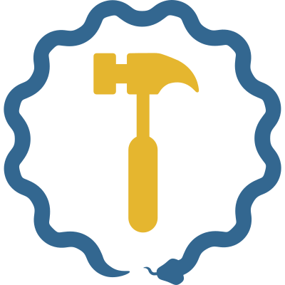

<h1 id="static-resources">Static Resources</h1>

<h2 id="button">Button</h2>

<table align="center">
  <thead>
    <tr>
      <th rowspan="1" colspan="1" align="center" style="text-align: center; vertical-align: middle;">File Name</th>
      <th rowspan="1" colspan="1" align="center" style="text-align: center; vertical-align: middle;">Preview</th>
      <th rowspan="1" colspan="1" align="center" style="text-align: center; vertical-align: middle;">Source</th>
      <th rowspan="1" colspan="1" align="center" style="text-align: center; vertical-align: middle;">Attribution</th>
    </tr>
  </thead>
  <tbody>
    <tr>
      <td><code>button/sponsor-afdian.png</code></td>
      <td></td>
      <td><a href="https://afdian.com/p/010ff078177211eca44f52540025c377">Link</a></td>
      <td></td>
    </tr>
    <tr>
      <td><code>button/sponsor-patreon.png</code></td>
      <td></td>
      <td><a href="https://imgur.com/ZuJBzSP">Link</a></td>
      <td>Courtesy of Imgur</td>
    </tr>
  </tbody>
</table>

<h2 id="mark">Mark</h2>

<table align="center">
  <thead>
    <tr>
      <th rowspan="1" colspan="1" align="center" style="text-align: center; vertical-align: middle;">File Name</th>
      <th rowspan="1" colspan="1" align="center" style="text-align: center; vertical-align: middle;">Preview</th>
      <th rowspan="1" colspan="1" align="center" style="text-align: center; vertical-align: middle;">Source</th>
      <th rowspan="1" colspan="1" align="center" style="text-align: center; vertical-align: middle;">Attribution</th>
    </tr>
  </thead>
  <tbody>
    <tr>
      <td><code>mark/appimage.svg</code></td>
      <td></td>
      <td><a href="https://commons.wikimedia.org/wiki/File:App-image-logo.svg">Link</a></td>
      <td>By Simon Peter, licensed under <a href="https://opensource.org/license/mit/">MIT</a>.</td>
    </tr>
    <tr>
      <td><code>mark/cmake.svg</code></td>
      <td></td>
      <td><a href="https://commons.wikimedia.org/wiki/File:Cmake.svg">Link</a></td>
      <td>By <a href="https://cmake.org/">CMake Team</a>, licensed under <a href="https://creativecommons.org/licenses/by/4.0/">CC BY 4.0</a>.</td>
    </tr>
    <tr>
      <td><code>mark/conan.svg</code></td>
      <td></td>
      <td><a href="https://github.com/conan-io/web/blob/main/conanio/public/conan-downloads-logo.svg">Link</a></td>
      <td>By <a href="https://conan.io/">Conan.io</a>, licensed under <a href="https://opensource.org/license/mit/">MIT</a>.</td>
    </tr>
    <tr>
      <td><code>mark/editorconfig.svg</code></td>
      <td></td>
      <td><a href="https://github.com/editorconfig/editorconfig/blob/4e1fdff8e2c91bd59b5216368c1513a8f7abd5d6/assets/EditorConfig_Logo.svg">Link</a></td>
      <td>By <a href="https://editorconfig.org/">EditorConfig Team</a>, licensed under <a href="http://creativecommons.org/licenses/by/3.0/">CC BY 3.0</a>.</td>
    </tr>
    <tr>
      <td><code>mark/emscripten.svg</code></td>
      <td></td>
      <td><a href="https://github.com/emscripten-core/emscripten/blob/93327152a04ced7889919a08d5255a4be84d200b/media/logo.svg">Link</a></td>
      <td>By <a href="https://emscripten.org/">Emscripten Team</a>, licensed under <a href="https://opensource.org/license/mit/">MIT</a>.</td>
    </tr>
    <tr>
      <td><code>mark/flatpak.svg</code></td>
      <td></td>
      <td><a href="https://en.m.wikipedia.org/wiki/File:Flatpak_Logo.svg">Link</a></td>
      <td>By <a href="https://flatpak.org/">Flatpak</a>, licensed under <a href="https://creativecommons.org/licenses/by/3.0/">CC BY 3.0</a>.</td>
    </tr>
    <tr>
      <td><code>mark/gdal.svg</code></td>
      <td></td>
      <td><a href="https://commons.wikimedia.org/wiki/File:GDALLogoColor.svg">Link</a></td>
      <td>By <a href="https://gdal.org/">GDAL Team</a>, licensed under <a href="https://opensource.org/licenses/MIT">MIT</a>.</td>
    </tr>
    <tr>
      <td><code>mark/harmonica.svg</code></td>
      <td></td>
      <td><a href="https://github.com/fatiando/logo">Link</a></td>
      <td>By <a href="https://www.fatiando.org/">Fatianto Team</a>, licensed under <a href="https://creativecommons.org/publicdomain/zero/1.0/">CC0 1.0</a>.</td>
    </tr>
    <tr>
      <td><code>mark/libuv.svg</code></td>
      <td></td>
      <td><a href="https://github.com/libuv/libuv/blob/a499b737bf58b076c0c51868a5095c7c29be7c32/img/logos.svg">Link</a></td>
      <td>By <a href="https://github.com/saghul">Saúl Ibarra Corretgé</a> and <a href="https://github.com/indutny">Fedor Indutny</a>, licensed under <a href="https://creativecommons.org/licenses/by/4.0/">MIT</a>.</td>
    </tr>
    <tr>
      <td><code>mark/linux.svg</code></td>
      <td></td>
      <td><a href="https://commons.wikimedia.org/wiki/File:Tux.svg">Link</a></td>
      <td>By <a href="http://www.isc.tamu.edu/~lewing/">Larry Ewing</a>, <a href="http://www.home.unix-ag.org/simon/">Simon Budig</a>, and <a href="https://github.com/garrett/Tux">Garrett LeSage</a>, licensed under <a href="https://creativecommons.org/publicdomain/zero/1.0/deed">CC0 1.0</a>.</td>
    </tr>
    <tr>
      <td><code>mark/nixos.svg</code></td>
      <td></td>
      <td><a href="https://brand.nixos.org/logos/nixos-logomark-default-gradient-recommended.svg">Link</a></td>
      <td>"NixOS Logo" by <a href="https://github.com/simon-frankau">Simon Frankau</a>, <a href="https://github.com/timbertson">Tim Cuthbertson</a>, and <a href="https://github.com/djacu">Daniel Baker</a> (maintained by the <a href="https://nixos.org/community/teams/marketing/">NixOS Marketing Team</a>), from <a href="https://github.com/NixOS/branding">nixos/branding</a>, licensed under <a href="https://creativecommons.org/licenses/by/4.0/">CC BY 4.0</a>.</td>
    </tr>
    <tr>
      <td><code>mark/numpy.svg</code></td>
      <td></td>
      <td><a href="https://github.com/numpy/numpy/blob/main/branding/logo/logomark/numpylogoicon.svg">Link</a></td>
      <td>By <a href="https://github.com/isabela-pf/">Isabela Presedo-Floyd</a>, licensed under <a href="https://creativecommons.org/licenses/by-sa/4.0/">CC BY-SA 4.0</a>.</td>
    </tr>
    <tr>
      <td><code>mark/pooch.svg</code></td>
      <td></td>
      <td><a href="https://github.com/fatiando/logo">Link</a></td>
      <td>By <a href="https://www.fatiando.org/">Fatianto Team</a>, licensed under <a href="https://creativecommons.org/publicdomain/zero/1.0/">CC0 1.0</a>.</td>
    </tr>
    <tr>
      <td><code>mark/pytest.svg</code></td>
      <td></td>
      <td><a href="https://github.com/pytest-dev/design/blob/43bbb9b7c2fd484a60c6922b903ca76796b3f45b/pytest_logo/pytest_logo_notext.svg">Link</a></td>
      <td>By <a href="https://pytest.org/">Pytest Team</a>, licensed under <a href="https://creativecommons.org/licenses/by-sa/4.0/">CC BY-SA 4.0</a>.</td>
    </tr>
    <tr>
      <td><code>mark/python.svg</code></td>
      <td></td>
      <td><a href="https://commons.wikimedia.org/wiki/File:Python-logo-notext.svg">Link</a></td>
      <td>By <a href="https://www.python.org/">Python.org</a>, licensed under <a href="https://www.gnu.org/licenses/old-licenses/gpl-2.0.html">GPL v2.0 or later</a>.</td>
    </tr>
    <tr>
      <td><code>mark/qemu.svg</code></td>
      <td></td>
      <td><a href="https://gitlab.com/qemu-project/qemu/-/blob/a8260d3876389eb52ca5c62ed4d80cdb7e025c85/ui/icons/qemu.svg">Link</a></td>
      <td>By <a href="https://github.com/benoit-canet">Benoît Canet</a>, licensed under <a href="https://creativecommons.org/licenses/by/3.0/">CC BY 3.0</a>.</td>
    </tr>
    <tr>
      <td><code>mark/ros-dark.svg</code></td>
      <td></td>
      <td><a href="https://github.com/ros-infrastructure/artwork/blob/master/orgunits/ros.svg">Link</a></td>
      <td>By <a href="https://www.openrobotics.org/">Open Robotics</a>, licensed under <a href="https://creativecommons.org/licenses/by-nc/4.0/">CC BY-NC 4.0</a>.</td>
    </tr>
    <tr>
      <td><code>mark/ros-white.svg</code></td>
      <td></td>
      <td><a href="https://github.com/ros-infrastructure/artwork/blob/master/orgunits/ros.svg">Link</a></td>
      <td>By <a href="https://www.openrobotics.org/">Open Robotics</a>, licensed under <a href="https://creativecommons.org/licenses/by-nc/4.0/">CC BY-NC 4.0</a>.</td>
    </tr>
    <tr>
      <td><code>mark/rtd-dark.svg</code></td>
      <td></td>
      <td><a href="https://brand-guidelines.readthedocs.org/branding.html">Link</a></td>
      <td>By <a href="https://about.readthedocs.com/">Read the Docs</a>, licensed under <a href="https://creativecommons.org/licenses/by/4.0/">CC BY 4.0</a>.</td>
    </tr>
    <tr>
      <td><code>mark/rtd-light.svg</code></td>
      <td></td>
      <td><a href="https://brand-guidelines.readthedocs.org/branding.html">Link</a></td>
      <td>By <a href="https://about.readthedocs.com/">Read the Docs</a>, licensed under <a href="https://creativecommons.org/licenses/by/4.0/">CC BY 4.0</a>.</td>
    </tr>
    <tr>
      <td><code>mark/setuptools.svg</code></td>
      <td></td>
      <td><a href="https://setuptools.pypa.io/en/stable/artwork.html">Link</a></td>
      <td>By <a href="https://github.com/abravalheri">Anderson Bravalheri</a>, licensed under <a href="https://opensource.org/license/mit/">MIT</a>.</td>
    </tr>
    <tr>
      <td><code>mark/sglang.svg</code></td>
      <td></td>
      <td><a href="https://github.com/sgl-project/sglang/blob/7a1f7fc5049d4fd5b3adc88fe48466fccbe676d8/assets/logo_square.svg">Link</a></td>
      <td>By <a href="https://github.com/sgl-project">The SGLang Team</a>, licensed under <a href="https://creativecommons.org/licenses/by-nc-nd/4.0/">CC BY-NC-ND 4.0</a>.</td>
    </tr>
    <tr>
      <td><code>mark/solidity-dark.svg</code></td>
      <td></td>
      <td><a href="https://github.com/argotorg/solidity/blob/11be2f4881d1644f15b026d1022388f06a034a34/docs/_static/img/logo.svg">Link</a></td>
      <td>By <a href="https://www.soliditylang.org/">The Solidity Authors</a>, licensed under <a href="https://creativecommons.org/licenses/by/4.0/">CC BY 4.0</a>.</td>
    </tr>
    <tr>
      <td><code>mark/solidity-light.svg</code></td>
      <td></td>
      <td><a href="https://github.com/argotorg/solidity/blob/11be2f4881d1644f15b026d1022388f06a034a34/docs/_static/img/logo-dark.svg">Link</a></td>
      <td>By <a href="https://www.soliditylang.org/">The Solidity Authors</a>, licensed under <a href="https://creativecommons.org/licenses/by/4.0/">CC BY 4.0</a>.</td>
    </tr>
    <tr>
      <td><code>mark/sphinx-dark.svg</code></td>
      <td></td>
      <td><a href="https://github.com/sphinx-doc/sphinx/blob/8878bee000c85c118b9be4b31d5baf7e3f25cc5f/doc/_themes/sphinx13/static/sphinx-logo.svg">Link</a></td>
      <td>By <a href="https://www.sphinx-doc.org/">Sphinx Team</a>, licensed under <a href="https://opensource.org/license/bsd-2-clause/">BSD 2-Clause</a>.</td>
    </tr>
    <tr>
      <td><code>mark/sphinx-white.svg</code></td>
      <td></td>
      <td><a href="https://github.com/sphinx-doc/sphinx/blob/8878bee000c85c118b9be4b31d5baf7e3f25cc5f/doc/_themes/sphinx13/static/sphinx-logo.svg">Link</a></td>
      <td>By <a href="https://www.sphinx-doc.org/">Sphinx Team</a>, licensed under <a href="https://opensource.org/license/bsd-2-clause/">BSD 2-Clause</a>.</td>
    </tr>
  </tbody>
</table>
